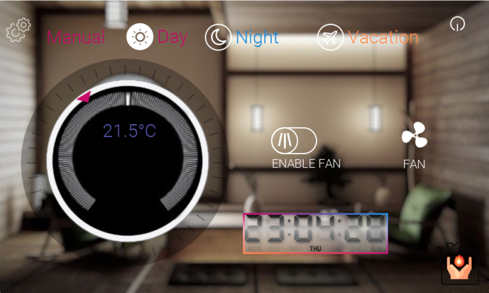
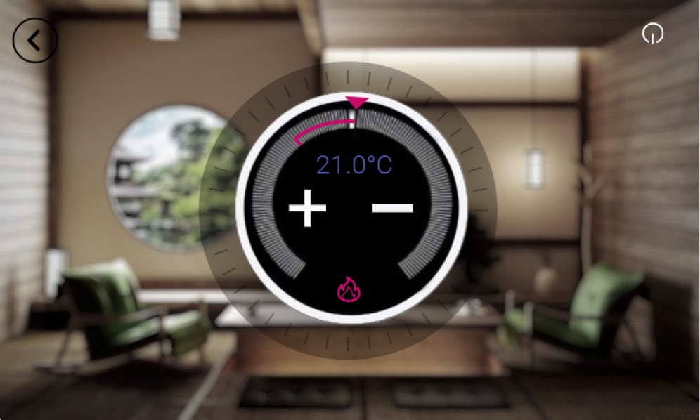
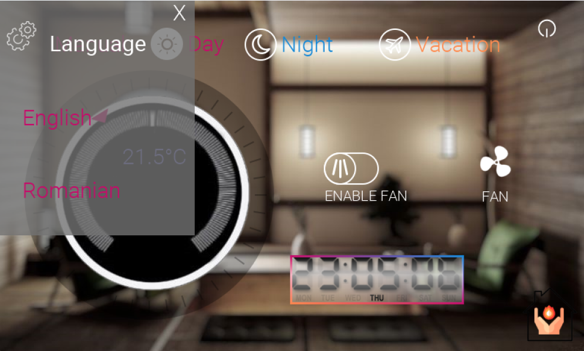

# Smart Temperature Control Application

## Overview

This is an application developed in Embedded Wizard 13 for a Smart Temperature Control system. The application is designed to provide a user-friendly interface for managing the temperature settings of a room or environment, offering various modes to suit different needs and preferences.

## Features

### 1. **Temperature Control Modes**
   - **Day Mode**: Sets a default temperature optimized for daytime comfort.
   - **Night Mode**: Sets a default temperature suitable for nighttime comfort, typically lower than daytime settings.
   - **Vacation Mode**: Activates a default temperature that is energy-efficient for times when the room or environment is unoccupied for an extended period.
   - **Manual Mode**: Allows users to set a custom temperature according to their preference.
     - In Manual Mode, the temperature can be increased or decreased by either clicking on the respective buttons or by rotating the control knob.

### 2. **Fan Control**
   - **Fan Mode**: Users can control the fan intensity and toggle the fan on or off.
     - When the fan is turned on, it helps reduce the room temperature.
     - Adjustable fan speed to suit user comfort.

### 3. **Language Settings**
   - The application supports both English and Romanian languages, making it accessible to a broader user base.

### 4. **Real-Time Clock Display**
   - The application features a real-time clock display that shows the current time, helping users to make informed decisions about temperature settings based on the time of day.

 

### Setup
Since the application uses images, it is necessary to run the HTML file on a local server to ensure that these images are displayed correctly in the browser. The easiest way to do this is as follows:

1. Install Node.js (installation instructions can be found here: [Node.js download](https://nodejs.org/en/download/package-manager)).
2. Open the command prompt (CMD) and run the command `npm install -g serve` to install a simple static server.
3. Navigate to the directory where the `EmWiApp.html` file is located using CMD, and run the command `serve`.
4. A message will appear, indicating the local address where the application is hosted (this address is also automatically copied to the clipboard).

By following these steps, you'll be able to view the application correctly with all its images in the browser.

